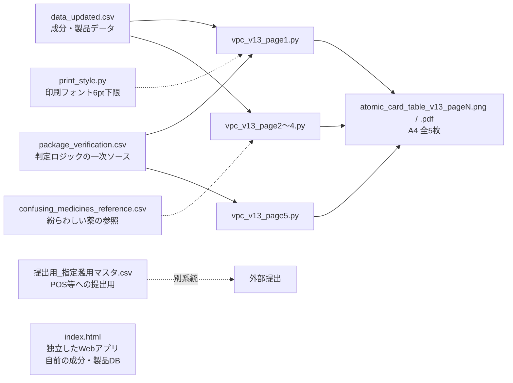

# pharma-gatekeeper

> [!IMPORTANT]
> **【開発者・運用者への重要なお知らせ：新製品追加時の注意】**
>
> 1. **【剤形による用量違いの罠】**
>    「シリーズ名」だけで一括管理してはいけません。同じ「ベンザブロックプラス」という名称でも、『カプレット（細長）』と『錠（円形）』で1回あたりの服用錠数が異なり、結果として「1日最大服用量」が変わるケースが多発しています。必ず**【実物のパッケージ】**または**【最新の添付文書】**を確認し、剤形ごとに別IDで定義してください。
>
> 2. **【1日最大量の算出基準】**
>    用法用量に「適宜増減」とある場合も、必ず**【認められている最大の用法・用量】**を `dailyDose` に設定してください。
>
> 3. **【判定の根拠】**
>    このマスタの各数値は、実物のパッケージ・最新の添付文書で確認した値に一致させること。判定ロジックの一次ソースは `package_verification.csv`。

## このリポジトリの概要

薬局（ミアヘルサ薬局）の「指定濫用防止医薬品」販売ルール遵守のための、レジ担当者向け参考資料（A4・全5枚、PNG/PDF）と、独立したWeb版参考アプリを管理しています。
複数のClaudeスレッドが並行作業しているため、作業前に `CLAUDE.md` と `WISHLIST.md` を確認してください。

## パイプライン

- 各ページは `python vpc_v13_pageN.py` で `atomic_card_table_v13_pageN.png` / `.pdf` を出力します（matplotlib）。
- `index.html` は上記スクリプトとは独立して動作します。

## CSVの区分

### 生きているファイル（編集・参照の対象）

| ファイル | 役割 |
|---|---|
| `package_verification.csv` | 早見表の判定ロジックの一次ソース（商品×包装規格・消費日数・小容量/大容量） |
| `data_updated.csv` | 成分・用法用量などの製品データ |
| `提出用_指定濫用マスタ.csv` | 提出用マスタ |
| `confusing_medicines_reference.csv` | 紛らわしい医薬品の参照表 |

### 中間生成物・過去の作業ファイル（原則そのまま。新規の判定には使わない）

`data.csv` / `Dify連携.csv` / `0724_14 - URL付きﾘｽﾄ.csv` / `otc_master_updates_abuse_prevention.csv` / `otc_master_updates_abuse_prevention_corrected.csv` / `otc_master_updates_abuse_prevention_normalized.csv` / `package_judgment_validation_report.csv` / `package_judgment_validation_report_v2.csv`

これらは `build*.py`、`validate_package_judgment*.py`、`normalize_package_product_names.py` などの過去スクリプトが生成・使用したものです。
